<table width="100%">
  <tr>
    <td width="70%" valign="top">
      
    </td>
    <td width="30%" valign="top">
      <h2>💻 Tech Stack:</h2>
      
      
      
      
      
      
      
      
      
      
      
      
      
      
      
      
      
      
      
      
      
      
      
      
      
      
      
      
      
      
      
      
      
    </td>
  </tr>
</table>
