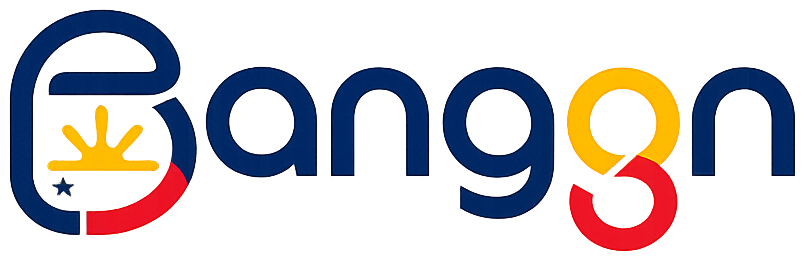

<picture>
  <source media="(prefers-color-scheme: dark)" srcset="./assets/xander-logo-for-dark-mode.png">
  <source media="(prefers-color-scheme: light)" srcset="./assets/xander-logo-for-light-mode.png">
  
</picture>

  Building Kouri (a multi-agent chatbot platform), Tether (Bluetooth-linked Flask services),
  and VisionX (real-time face recognition with InsightFace/CUDA) — mostly Python and
  React/TypeScript, with some C++/Qt on the side for desktop tooling.
  Check out my <a href="https://github.com/TadeyRuk?tab=repositories">repositories</a> for more.

 

## Projects

<table width="100%">
<tr>
<td align="center" width="280"><a href="https://github.com/TadeyRuk/Kouri-Public"> Kouri</a></td>
<td align="center" width="280"><a href="https://github.com/TadeyRuk/Achievo"> Achievo</a></td>
<td align="center" width="280"><a href="https://github.com/TadeyRuk/Beans"> Beans</a></td>
</tr>
<tr>
<td align="center" width="280"><a href="https://github.com/TadeyRuk/eGov"> eGov</a></td>
<td align="center" width="280"><a href="https://github.com/TadeyRuk/Eclipse"> Eclipse</a></td>
<td align="center" width="280"><a href="https://github.com/TadeyRuk/Tether"> Tether</a></td>
</tr>
<tr>
<td align="center" width="280"><a href="https://github.com/TadeyRuk/Flux"> Flux</a></td>
<td align="center" width="280"><a href="https://github.com/TadeyRuk/Arbiter"> Arbiter</a></td>
<td align="center" width="280"><a href="https://github.com/TadeyRuk/Bud2"> Bud2</a></td>
</tr>
<tr>
<td align="center" width="280"><a href="https://github.com/TadeyRuk/heatmap--nasa-space--apps"> NASA Heatmap</a></td>
<td align="center" width="280"><a href="https://github.com/TadeyRuk/Kouri-HandAssistant-Pre-Alpha"> HandAssistant</a></td>
<td align="center" width="280"><a href="https://github.com/TadeyRuk/Kouri-ChatBot-BETA_Preview"> Kouri Beta</a></td>
</tr>
</table>
